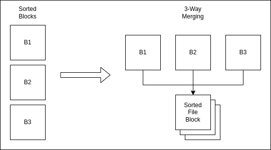

# DSM23 Project Phase - 2

Submission date: 

Submitted By
| Roll number | Names |
|-----------|-----------|
| 2022201004 | Yash Singhal |
| 2022201079 | Priyanshu Bansal |
| 2022202023 | Anurag Ghosh |

## Assumptions
<ul>
  <li>All the data being written into the .csv file must be int (no commas). </li>
  <li> Summation of all values not greater than range of int.</li>
  <li> Number of columns in resultant table should not exceed size of block after join.</li>
  <li> All float values will be rounded to floor value before being written back into the file.</li>
  <li> Tables with no rows are not loaded. </li>
</ul>

## External Sort
#### Syntax
```sql
SORT <table_name> BY <column_name1, column_name2,..., column_namek> IN
<ASC|DESC, ASC|DESC,..., ASC|DESC>
```
#### Example
```sql
SORT EMPLOYEE BY GENDER, SALARY IN ASC, DESC
```


<ul>
  <li> We get the file name through the command. We fetch this file one block at a time and sort individual block. </li>
  <li> We have all the individual blocks sorted for now. Now we take 9 blocks at a time. </li>
  <li> Do 9-way merging into a "write-back" buffer. As soon as this buffer fills up we write it back and start afresh with a new empty block. </li>
  <li> As we can see this creates 9-block sorted sub file and then we merge such subfiles using the same 9-way merge. </li>
  <li> When we are done, we get the entire file as one sorted file with original number of blocks </li>
</ul>

## JOIN
#### Syntax
```sql
<new_relation_name> <- JOIN <tablename1>, <tablename2> ON <column1>
<bin_op> <column2>
```
#### Example
```sql
Result <- JOIN Students, Courses ON ID == RollNo 
```
<ul>
  <li> </li>
  <li> </li>
  <li> </li>
</ul>

## Order By
#### Syntax
```sql
<new_table> <- ORDER BY <attribute> ASC|DESC ON <table_name>
```
#### Example
```sql
Result <- ORDER BY Year_Released ASC ON Movies
```
<ul>
  <li> </li>
  <li> </li>
  <li> </li>
</ul>

## Group By
#### Syntax
```sql
<new_table> <- GROUP BY <grouping_attribute> FROM <table_name> HAVING
<aggregate(attribute)> <bin_op> <attribute_value> RETURN
<aggregate_func(attribute)>
```
#### Example
```sql
T1 <- GROUP BY Department_ID FROM EMPLOYEE HAVING
AVG(Salary) > 50,000 RETURN MAX(Salary)
```
<ul>
  <li> </li>
  <li> </li>
  <li> </li>
</ul>

## Learnings

<ul>
  <li> Implementing External Sort where only a part of file can be accessed once. </li>
  <li> Difference between implementing a 2 way merge and a multiple way merge (>=3).</li>
  <li> We learnt how complexity reduces for Join, Order By and Group By if we are working on sorted tables.</li>
  <li> We learnt why join is an expensive operation compared to just Order By and Group By. </li>
  <li> If Join is performed on only equality condition, it can be further optimized. </li>
  <li> Importance of doing operations in an optimized manner so as to improve query performance. </li>
</ul>

## Contributions
| Names | Contributions |
|-----------|-----------|
| Yash Singhal | External-Sort & Join & Order-By |
| Priyanshu Bansal | Write-Back & Order-By |
| Anurag Ghosh | External-Sort & Join & Group-By|

